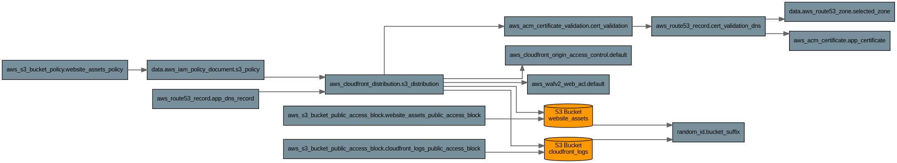
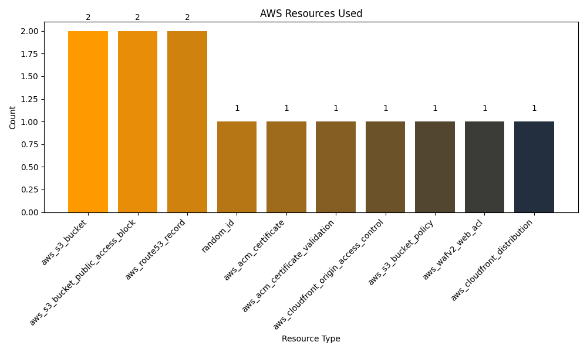

# Infrastructure Visualization

## Overview

This visualization shows the AWS infrastructure defined in the Terraform files.
Generated by Inframate on Mon May 12 17:50:47 UTC 2025

## Infrastructure Diagram

## Resource Summary

# Infrastructure Resource Summary

## Resource Counts

| Resource Type | Count |
|--------------|-------|
| aws_s3_bucket | 2 |
| aws_s3_bucket_public_access_block | 2 |
| aws_route53_record | 2 |
| random_id | 1 |
| aws_acm_certificate | 1 |
| aws_acm_certificate_validation | 1 |
| aws_cloudfront_origin_access_control | 1 |
| aws_s3_bucket_policy | 1 |
| aws_wafv2_web_acl | 1 |
| aws_cloudfront_distribution | 1 |
